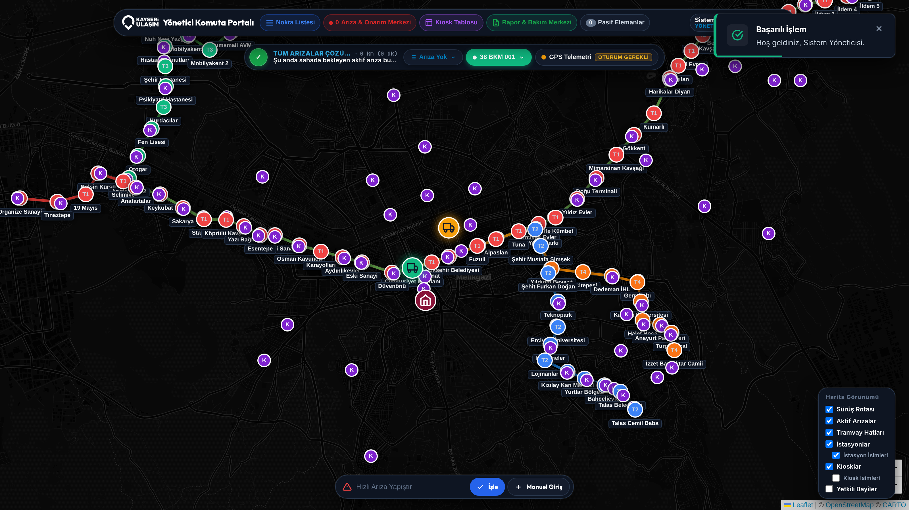

# Kayseri Ulaşım - Akıllı Rota Optimizasyonu & Saha Operasyon Portalı


Kayseri Ulaşım A.Ş. raylı sistem hatları, tramvay istasyon donanımları (turnikeler, iade validatörleri, istasyon kioskları, serbest geçiş kapıları) ve kent genelindeki kart dolum noktalarının (Otomatik Kiosk & Yetkili Bayi) arıza müdahale süreçlerini optimize eden; 2-Opt Gezgin Satıcı Algoritması (TSP), Çift Araç Yük Paylaşımı (Dual-Split TSP), Doğal Dil İşleme (NLP) tabanlı WhatsApp arıza ayrıştırıcı ve çok formatlı kurumsal raporlama mimarisine sahip web tabanlı karar destek platformudur.



---

## 1. Sistem Mimarisi ve Teknoloji Yığını

Platform, yüksek performanslı ve modüler **Node.js + TypeScript** katmanı üzerine inşa edilmiştir.

### Temel Beceriler & Teknoloji Bileşenleri
* **Backend:** Node.js, Express.js, TypeScript (Strict Mode).
* **Veritabanı Katmanı:** `better-sqlite3` (Yerel ilişkisel veritabanı, UTF-8 Türkçe karakter ve harf kümesi desteği).
* **Ön Yüz (UI):** Vanilla HTML5 / JavaScript (ES6+), Vanilla CSS (Modüler CSS mimarisi, CSS gradyanları ve emotikon barındırmayan sade tasarım).
* **Harita ve Görselleştirme:** Leaflet.js (Canlı araç takibi, istasyon ağ rotası ve poligon katmanları).
* **Raporlama Motoru:** `pdfkit` (Çok sayfalı vektörel PDF), `exceljs` (Çok sekmeli stilize Excel).
* **Konteynerizasyon:** Docker & Docker Compose.
* **Test Altyapısı:** Jest & Supertest.

---

## 2. Temel Modüller ve Algoritmik Yetenekler

### A. Çok Kriterli Akıllı Rota Optimizasyonu (TSP & 2-Opt)
Sahadaki bakım aracının arızalı istasyon ve kiosklara en az mesafeyi katederek ve en yüksek öncelikli arızalara ilk müdahaleyi yapacak şekilde ulaşmasını sağlar:
* **Öncelik Puanlama Hiyerarşisi:**
  1. *Turnike Kaçak Düştü (Enerji Yok):* 100 Puan (En Acil - İstasyon Girişi Kilitlenir)
  2. *Kiosk Arızası (Dahili Ekip):* 75 Puan (Bilet ve Yükleme İşlemi Durur)
  3. *Turnike Donanım Arızası:* 50 Puan (Giriş Kapasitesi Düşer)
  4. *Serbest Geçiş Kapısı Arızası:* 35 Puan (Engelli/Serbest Geçiş)
  5. *İade Validatörü Arızası:* 20 Puan (Ücret İadesi Akışı)
* **Kümeleme (Clustering) Avantajı:** Bir istasyona veya bölgeye gidildiğinde, o lokasyondaki ikincil arızalar da rotaya dahil edilerek gereksiz kilometre ve zaman kaybı engellenir.
* **Taşeron Filtresi:** Taşeron firmaların sorumluluğundaki arızalar (Örn: "Kaset Dolu", "Para Sıkıştı") dahili bakım rotasına alınmaz veya pasif işaretlenir.

### B. Çift Araç Yük Paylaşımı (Dual-Split TSP)
Sistemde tanımlı iki saha bakım aracı (`38 BKM 001` - Birincil ve `38 BKM 002` - İkincil) aktif olduğunda:
* Mevcut arızalar iki aracın konumlarına ve yük ağırlıklarına göre otomatik olarak iki bağımsız alt rotaya bölünür (`DUAL_SPLIT`).
* Kullanıcı dilerse tek bir araca odaklanarak tüm arızaları o araca yükleyebilir (`SINGLE_VEHICLE`).

### C. WhatsApp Doğal Dil Arıza Ayrıştırıcı (NLP Parser)
Saha ekiplerinden gelen serbest metin WhatsApp mesajları (Örn: *"Düvenönü 1. Turnike Kaçak Düştü; Mimsin Kiosk 2 bilet alma ünitesi arızalı"*) kural tabanlı NLP regex motoru ile ayrıştırılarak otomatik olarak arıza kaydına dönüştürülür ve veritabanına işlenir.

### D. Donanım & Kiosk Takas (Transfer) Modülü
Arızalanan bir kiosk veya turnikenin sahadan kaldırılıp başka bir noktaya transfer edilmesi veya yedek cihazla takas edilmesi durumunda cihaz hareket geçmişi (`cihaz_hareketleri`) audit log olarak kaydedilir ve veritabanı envanteri güncellenir.

### E. Çok Formatlı Kurumsal Raporlama
* **PDF Raporlama:** Türkçe font desteği, sayfa numaralandırması ve özet istatistik tabloları içeren yayın kalitesinde PDF çıktısı.
* **Excel Raporlama:** Genel Özet, Arıza Detayları, Donanım Envanteri ve Cihaz Hareketleri sekmelerini barındıran stilize `.xlsx` çıktısı.

---

## 3. Veritabanı Şeması (SQLite - `kayseri_ulasim.db`)

Tüm veritabanı tabloları, sütun isimleri ve yabancı anahtar ilişkileri Türkçe isimlendirme standartlarına uygun olarak tasarlanmıştır:

| Tablo Adı | Açıklama |
| :--- | :--- |
| `istasyonlar` | 75 Raylı sistem istasyonunun koordinat ve donanım sayıları |
| `hatlar` | T1, T2, T3, T4 tramvay hat bilgileri |
| `cihazlar` | İstasyonlardaki 600 turnike, iade validatörü ve serbest geçiş kapısı |
| `otomatik_kiosklar` | 105 Otomatik dolum ve bilet satış otomatı |
| `yetkili_bayiler` | 374 Yetkili kart dolum bayisi |
| `arizalar` | Aktif ve çözülmüş arıza bildirim kayıtları |
| `arac_telemetri` | Saha bakım araçlarının canlı/simüle GPS konum ve telemetri verileri |
| `cihaz_hareketleri` | Cihaz transfer, takas ve lokasyon değişim günlükleri |
| `raporlar` | Oluşturulan PDF ve Excel raporlarının arşiv kayıtları |
| `kullanicilar` | Yönetici (`admin`) ve Saha Operatörü (`saha`) hesapları |

---

## 4. Kurulum ve Çalıştırma Rehberi

### Gereksinimler
* Node.js v18 veya üzeri
* npm v9 veya üzeri
* Docker & Docker Compose (İsteğe bağlı)

### A. Yerel Geliştirme Ortamı (Local Dev)

1. Depoyu klonlayın ve proje dizinine geçin:
   ```bash
   cd KayseriUlasimProje
   ```

2. Bağımlılıkları yükleyin:
   ```bash
   npm install
   ```

3. Uygulamayı geliştirici modunda başlatın:
   ```bash
   npm run dev
   ```
   *Uygulama `http://localhost:5001` adresinde yayına girecektir.*

### B. Docker İle Çalıştırma

Docker konteynerini derlemek ve başlatmak için:
```bash
docker compose up --build -d
```

---

## 5. Kullanıcı Hesapları ve Giriş Bilgileri

| Kullanıcı Adı | Şifre | Rol | Yetki Kapsamı |
| :--- | :--- | :--- | :--- |
| `admin` | `admin123` | `ADMIN` | Tam Yetki (Cihaz ekleme, silme, takas, raporlama, kullanıcı yönetimi) |
| `saha` | `saha123` | `OPERATOR` | Saha İzleme & Rota Alma (Canlı harita, arıza takibi, navigasyon) |

---

## 6. Birim Testleri ve Doğrulama

Sistemdeki tüm servisler, API uç noktaları, rota algoritmaları ve NLP ayrıştırıcıları Jest altyapısı ile test edilmektedir.

Testleri çalıştırmak için:
```bash
npm test
```

---

## 7. Proje Dizin Yapısı

```
KayseriUlasimProje/
├── app/                        # Web ön yüz şablonları ve statik varlıklar
│   ├── static/
│   │   ├── css/                # Modüler Vanilla CSS stil dosyaları
│   │   ├── img/                # Görseller ve kurumsal logolar
│   │   └── js/                 # Harita, navigasyon ve UI yöneticileri
│   └── templates/
│       └── index.html          # Ana portal HTML şablonu
├── data/                       # SQLite veritabanı ve ham JSON envanteri
│   ├── kayseri_ulasim.db       # Ana veritabanı
│   └── kayseri_ulasim_data.json# 75 istasyon ve 479 dolum noktası ham verisi
├── src/                        # TypeScript backend kaynak kodları
│   ├── algorithms/             # TSP, 2-Opt, corridor sweep rota çözücüleri
│   ├── config/                 # Sistem konfigürasyonları
│   ├── constants/              # Sabitler ve Enum tanımları
│   ├── database/               # Veritabanı bağlantı ve şema kurucuları
│   ├── middlewares/            # Yetkilendirme ve doğrulama katmanı
│   ├── routes/                 # Express API rotaları
│   ├── services/               # İş mantığı, telemetri, rapor ve rota servisleri
│   └── server.ts               # Uygulama giriş noktası
├── tests/                      # Jest birim test senaryoları
├── Dockerfile                  # Production Docker yapılandırması
├── docker-compose.yml          # Docker Compose orkestrasyonu
├── package.json                # Bağımlılıklar ve npm betikleri
├── tsconfig.json               # TypeScript derleme ayarları
└── README.md                   # Proje dokümantasyonu
```

---

## 8. Lisans ve Haklar

Bu proje Kayseri Ulaşım A.Ş. saha operasyonları ve akademisyen değerlendirmeleri için özel olarak geliştirilmiştir.
